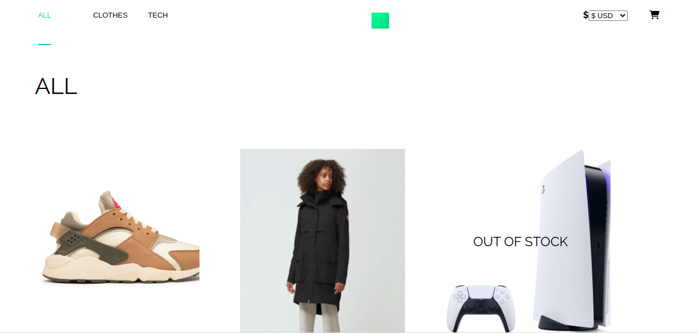
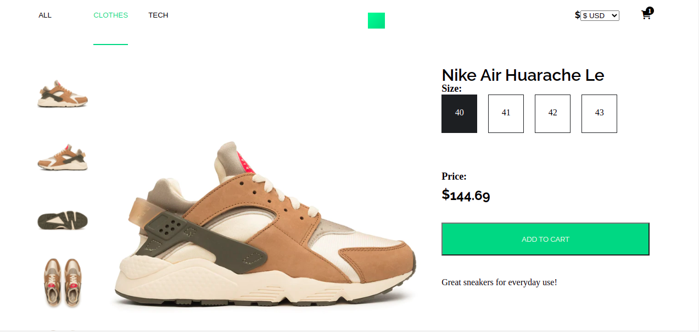
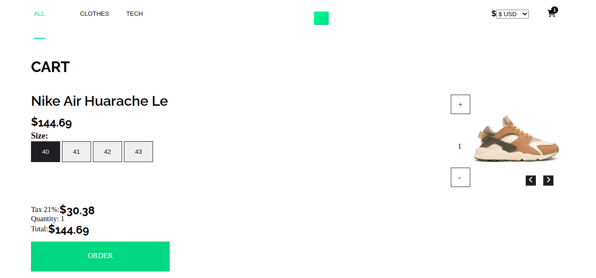

# Scandiweb Junior React Developer Assignment

This is my own solution to the Scandiweb take home assignment for junior role

    
    
    
    

     
    <a href="https://github.com/Kingobaino1/merchandise-store"><strong>Explore this project »</strong></a>
     
     &#10023;
    <a href="#Prerequisites">Prerequisites</a> &#10023;
    <a href="#Getting-Started">Getting Started</a> &#10023;
    <a href="#Usage">Usage</a> &#10023;
    <a href="#Run-tests">Run tests</a> &#10023;
    <a href="#Deployment">Deployment</a> &#10023;
    <a href="#Author">Author</a> &#10023;
    <a href="#Show-your-support">Show your support</a> &#10023;
    <a href="#License">License</a> &#10023;
    <a href="#Feedbacks">Feedbacks</a> &#10023;
    <a href="https://github.com/Kingobaino1/merchandise-store/issues">Report Bug</a>    &#10023;

 

### Prerequisites
 - Visit [here](https://github.com/scandiweb/junior-react-endpoint) and follow the instructions therein to setup and start the server.
   

## Getting Started

1. Open Terminal.
2. Navigate to your desired location to download the contents of this repository.
3. Copy and paste the following code into the Terminal :
   `git clone git@github.com:Kingobaino1/client.git`
4. Run `cd client`
5. Install the needed dependencies `npm install`
6. Start the server run `npm start`

### Usage

While the server is still on, open your browser and

# Visit http://localhost:3000

<small>Home page</small>

# Product Display page:

<small>PDP</small>

# Cart:

<small>Cart</small>

## Author

👤 **Kingsley Ibeh**

- Github: [@githubhandle](https://github.com/Kingobaino1)
- Twitter: [@twitterhandle](https://twitter.com/ibehkingso)
- Linkedin: [linkedin](https://www.linkedin.com/in/kingsley-ibeh)

## Show your support

Give a ⭐️ if you like this project!

## License

This project is [MIT](LICENSE) licensed.
